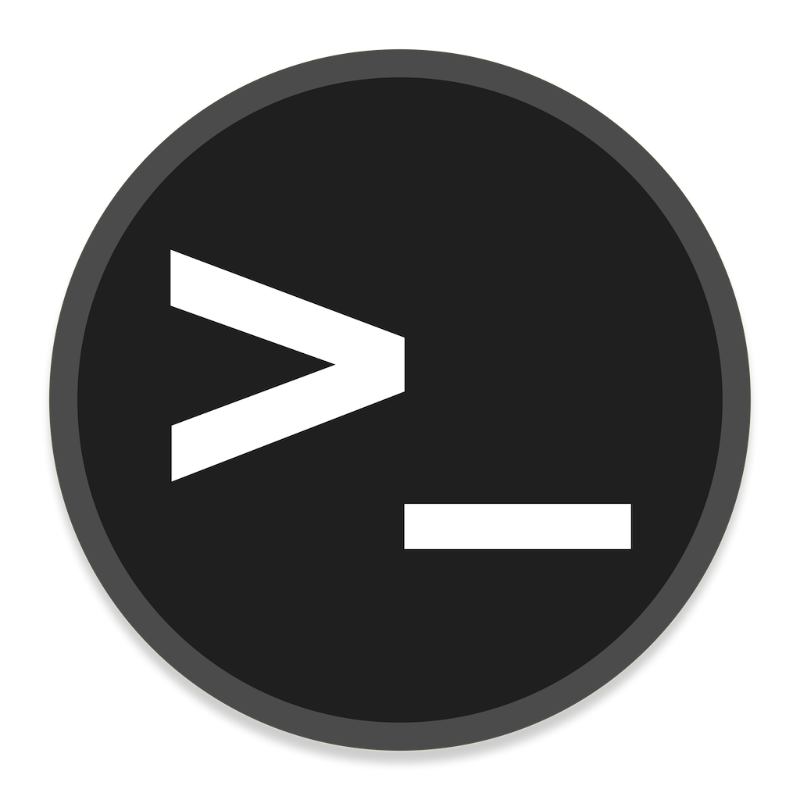

<!-- PROJECT LOGO -->
 

  

<h3 align="center">Shellscript examples</h3>

  

    Shellscript Posix examples for FreeBsd/TcBsd
     
    <a href="https://github.com/tomatensaft/ShellRepository"><strong>Explore the docs »</strong></a>
     
     
    <a href="https://github.com/tomatensaft/ShellRepository">View Demo</a>
    ·
    <a href="https://github.com/tomatensaft/ShellRepository">Report Bug</a>
    ·
    <a href="https://github.com/tomatensaft/ShellRepository">Request Feature</a>
  

 
 

<!-- STRUCTURE -->
## Structure

- [ ] Bhyve
- [ ] Beckhoff
- [ ] Git
- [ ] Network
- [ ] System
- [ ] Packages
- [ ] Tmux
- [ ] Zfs
- [ ] Beckhoff
    - [ ] System
    - [ ] Ads